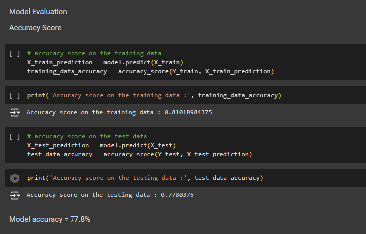
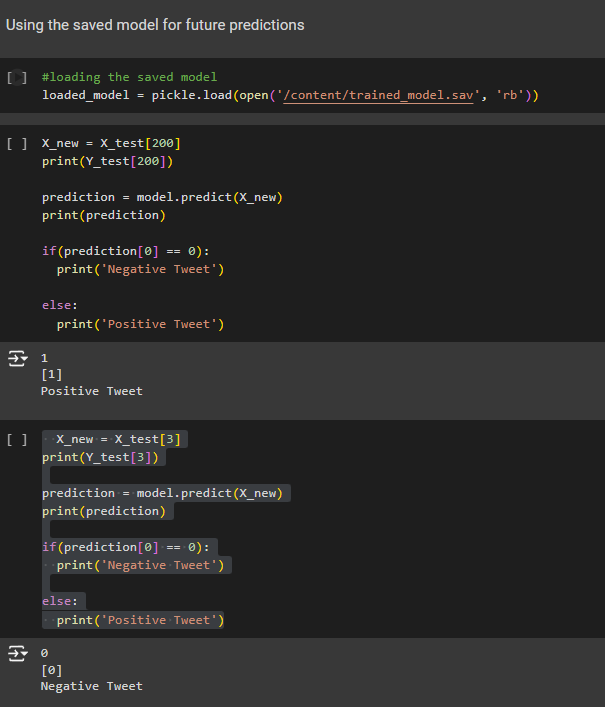

# Sentiment Analysis on Twitter Data

This project performs **Sentiment Analysis** on a large Twitter dataset (Sentiment140) using **Logistic Regression**. The goal is to classify tweets as either **positive** or **negative**, based on the words and patterns found in the tweet content.

## Project Overview

Sentiment analysis is a natural language processing (NLP) technique used to determine the sentiment behind a piece of text. In this project, we classify tweets as expressing **positive** or **negative** sentiment using a machine learning approach. The dataset used contains 1.6 million tweets, where each tweet is labeled as either positive (1) or negative (0).

The process involves:
1. **Preprocessing** the text data by removing unwanted characters, lowercasing, stemming, and removing stopwords.
2. Converting the cleaned text into numerical features using **TF-IDF** (Term Frequency-Inverse Document Frequency).
3. Training a **Logistic Regression** model on the preprocessed data.
4. Testing the model and calculating its accuracy.
5. Saving and loading the trained model using **Pickle**.

## Tools and Libraries Used

The project is built using Python, and the following libraries are used:

1. **Pandas**: For data manipulation and loading the CSV file.
2. **Numpy**: For numerical operations.
3. **NLTK (Natural Language Toolkit)**: For text preprocessing (stopword removal, stemming).
4. **Sklearn**:
   - **TfidfVectorizer**: For converting text data to numerical features.
   - **Logistic Regression**: For building the classification model.
   - **Train-test split**: For splitting the dataset into training and testing subsets.
   - **Accuracy Score**: For evaluating the model's performance.
5. **Pickle**: For saving and loading the trained model.
6. **Kaggle API**: For downloading the dataset from Kaggle.

## Dataset

The dataset used is **Sentiment140**, available on Kaggle. It contains 1.6 million tweets, where each tweet is labeled as positive or negative sentiment.

### Columns in the dataset:
- `target`: The sentiment of the tweet (0 = negative, 1 = positive).
- `id`: The ID of the tweet.
- `date`: The date of the tweet.
- `flag`: The query (if any).
- `user`: The user who tweeted.
- `text`: The text of the tweet.

## Project Steps

1. **Text Preprocessing**:
   - Removal of non-alphabetic characters.
   - Converting text to lowercase.
   - Tokenizing and removing stopwords.
   - Stemming words to their root form using the Porter Stemmer.

2. **Feature Extraction (TF-IDF)**:
   - The preprocessed text is transformed into numerical features using **TF-IDF**, which calculates how important a word is relative to all documents in the dataset.

3. **Model Training**:
   - The Logistic Regression model is trained on the **TF-IDF vectors** to classify tweets as positive or negative.

4. **Model Evaluation**:
   - The model is tested on unseen data (test set), and the accuracy is calculated.

## Results

- **Training Accuracy**: 81.02%
- **Testing Accuracy**: 77.80%

## Future Improvements

Here are some potential improvements that could be made to the project:

1. **Advanced NLP Techniques**: Implement more advanced NLP techniques such as **Word2Vec** or **BERT** to better capture the context and meaning of words, improving the model's ability to understand subtle nuances in sentiment.
   
   - **Word2Vec**: A neural network model that learns word embeddings based on their context, improving the representation of words and making it easier for the model to capture relationships between them.
   - **BERT (Bidirectional Encoder Representations from Transformers)**: A state-of-the-art transformer-based model that deeply understands the context of each word in relation to the surrounding words, significantly improving performance on sentiment classification.

2. **Real-time Sentiment Analysis**: Extend the project to classify tweets in real-time by integrating the **Twitter API** to stream live data. This could be used to monitor the sentiment of tweets as they are posted, providing insights into ongoing trends and events in real-time.

